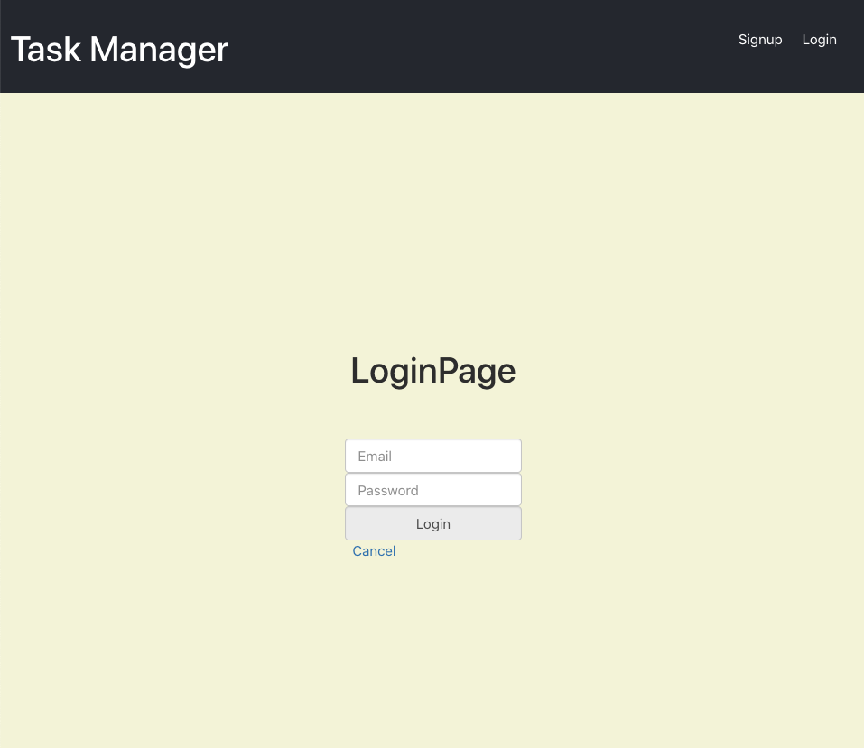
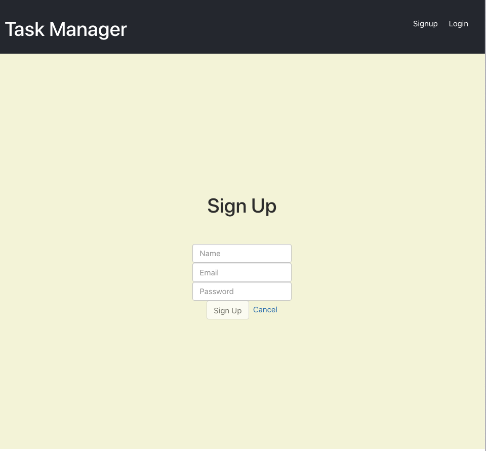
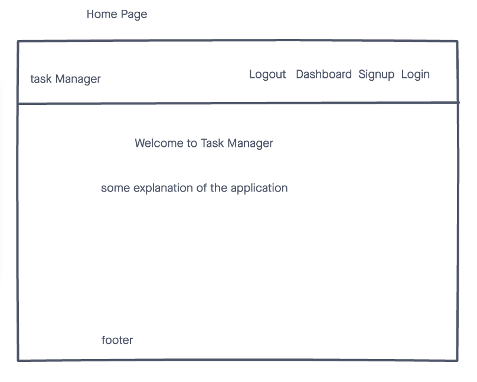
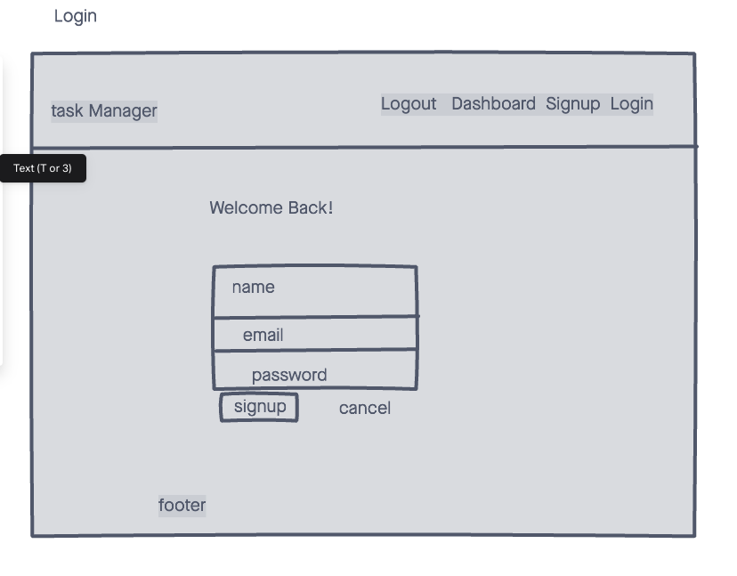
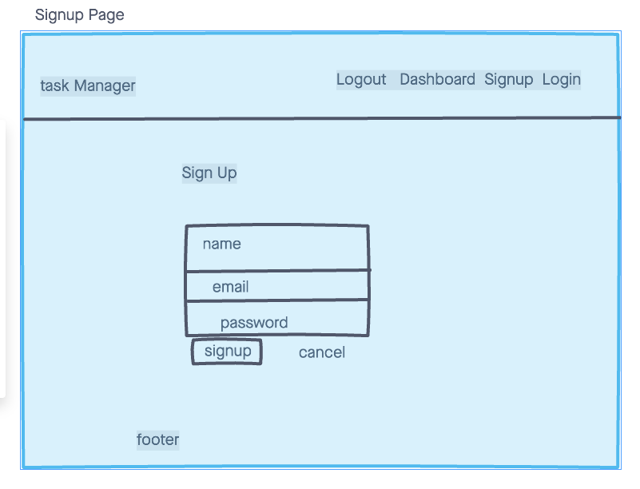
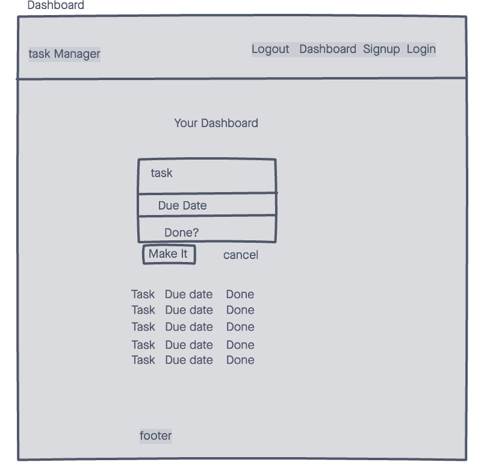

# Task Manager

Welcome to Task Manager! This is your personal way to brain dump all of those task on random sticky notes, planers, crumbled up napkins, multiple task apps, calendars,and more! Just login or signup to get started!

- Heroku Live Website: 
[Click Here](https://task-manager13.herokuapp.com)

## Screen Shots:

# Technologies Used:
- CSS
- HTML
- JavaScript
- Mongo DB
- Express
- Node
- Mongoose
- React
- Trello
- Heroku

# Getting started
-  Trello project planning board:
[Click Here](https://trello.com/b/g570SDzx/project-3)

- Inital Wireframes:

# Unsolved Problems
- error "Expected an assignment or function call and instead saw an expression"

# Future Enhancements:
- seperate lists
